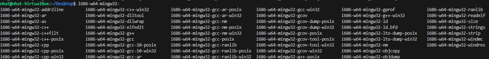

# <p align="center">**Installing MinGW-w64 on Ubuntu 20.04**</p>

## **1. Introduction**

`MinGW-w64` is a development and runtime environment designed for creating 32-bit and 64-bit Windows applications. It leverages the Windows API and the GNU Compiler Collection (gcc).

`MinGW-w64` enables developers to write code for Windows API and libraries while working on a Linux system.

## **2. Installation**

### **2.1. Method 1: Using `apt-get`**
- Update the apt database:

```shell
sudo apt-get update
```

- Install MinGW-w64:

```shell
sudo apt-get -y install mingw-w64
```

### **2.2. Method 2: Using `apt`**
- Update the apt database:

```shell
sudo apt update
```

- Install MinGW-w64:

```shell
sudo apt -y install mingw-w64
```

### **2.3. Check if installation is successful**

- If successfull, may executable files will be added in your PC:



- Write a "Hello World" program in C++ and try compiling

```shell
i686-w64-mingw32-g++ -o main.exe main.cpp
```

- Copy it into a Windows PC and run (I used Windows 11 to test).

## **3. Uninstalling `MinGW-w64`**

- To remove only the MinGW-w64 package:

```shell
sudo apt-get remove mingw-w64
```

- To uninstall MinGW-w64 and its dependencies no longer needed by Ubuntu 20.04:

```shell
sudo apt-get -y autoremove mingw-w64
```

- To completely remove MinGW-w64 configurations, data, and all dependencies:

```shell
sudo apt-get -y autoremove --purge mingw-w64
```

## References
- MinGW-w64 website
- MinGW-w64 on packages.ubuntu.com