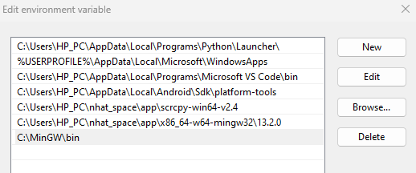

# <p align="center">**Installing MinGW on Windows 11**</p>

## **1. Understanding MinGW**
**Concept**
- **MinGW** (Minimalist GNU for Windows) is a development environment designed for native Windows applications.
- It provides open-source tools that ensure compatibility with the Windows operating system.

**Why MinGW on Windows?**
- **Compatibility**: MinGW ensures your applications run seamlessly on Windows 11.
- **Open-Source Advantage**: Leverage freely available open-source tools.
- **Streamlined Development**: Focus on your code rather than system intricacies.


## **2. Download MinGW**
- Visit the official [MinGW website](https://sourceforge.net/projects/mingw/) and download the latest version.
- Choose the installer that matches your system specifications.

## **3. Installation Wizard**

### **3.1. Installing `MinGW Installation Manager`**
- Run the downloaded installer (usually an `.exe` file).
- Follow the on-screen instructions.

```notes
At the moment I wrote this document, the installer which I downloaded is for installing "MinGW Installation Manager".

"MinGW Installation Manager" is an application which helps you to select packages of "MinGW" toolchain and to install them.
```

### **3.2. Installing `MinGW` packages**

- Open `MinGW Installation Manager` application.
- Select "Basic Setup" > check all the basic packages here.


```notes
- You can select the components you need for your development requirements now or later.
```

## **4. Configure Environment Variables**
- Open Windows `Advanced System Settings`


```
If you don't know how to open System Information, use Google please.
```

- Click "Environment Variables" > At "User variable", select "Path" and click "Edit".

```
If "Path" doesn't exist yet, click New to create one.
```

- Add path of `MinGW bin` directory. This ensures that your system recognizes MinGW commands.



## **5. Verify Installation**
- Open your command prompt (E.g: `PowerShell`) and type the following command:

```shell
gcc --version
```

- If successful, you'll receive information about the installed GCC version, confirming that MinGW is ready for use.

```
Pay attention that applications which have been run before you set Environment variable "path" won't update automatically.

So, you must close and open any application which you intent to use with "MinGW" now.
```

---
**Happy coding! 🚀**