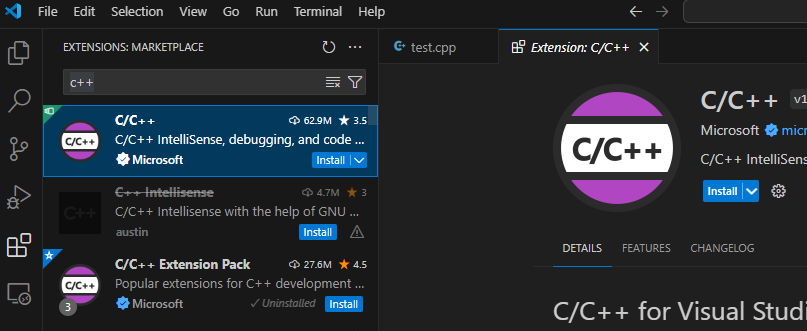
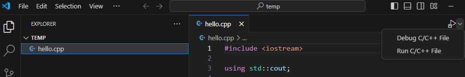
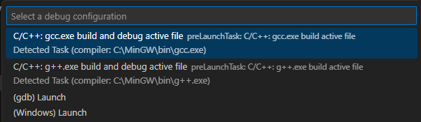
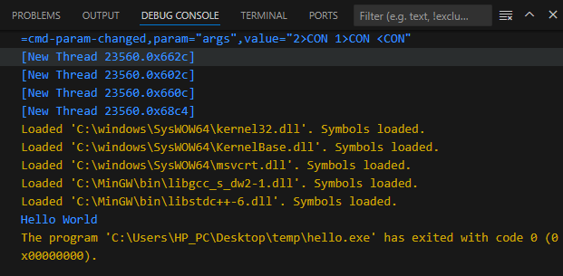
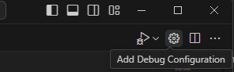
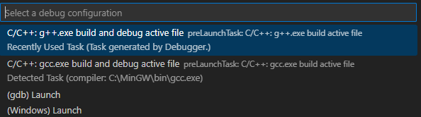
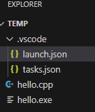

# <p align="center"> Set Up Visual Studio Code As a C++ IDE </p>

## **1. Overview**

This document will help you to set up Visual Studio Code as a C++ IDE. This guide show you how to deal with not only single `cpp` file but also multiple `cpp` files.

However, I don't recommend that you should use this method for a real and big C/C++ project. Instead, you should use some `build system` such as `GNU Make`, `CMake`, 

## **2. Assumption**

Assume that you have already
- Installed Visual Studio Code on Windows.
- Installed `"MinGW"` toolchain on Windows.
- Set up Environment variable to use `"MinGW"`.

## **3. Notes**
- In this document, I assume that `bin` directory of MinGW is `C:\MinGW\bin`. If you didn't install or didn't set up environment variable for `MinGW`, please do it, following some other documents.
- Paths which I mentioned in this document is suitable for me, you should use your own paths.


## **4. Step by step**

### **4.1. Install `C/C++` extension**

- Click 'extension' button and search for C/C++ extension. Install it.



- After installing `C/C++` extension, a `"run"` button will appears every time you open an `cpp` file.



### **4.2. Set up `tasks.json` for 1 `cpp` file**

```
This file has configs for building an executable file from source code.
```


```
Assume that your current root directory doesn't have `tasks.json` (or it exists but you don't have suitable task to run C/C++ file) 

Assume that you open a `cpp` file which defines `main` function.
```

- click "down arrow" button > Select "Run C/C++ File".


- VSC will prompt you to select some action which is detected automatically by VSC > Select `g++.exe`.



- If successfully, your `cpp` code files will be compiled and run. And your new task will be added in `.vscode/tasks.json` file .




### **Example of `tasks.json`**
```json
{
    "tasks": [
        {
            "type": "cppbuild",
            "label": "C/C++: gcc.exe build active file",
            "command": "C:\\MinGW\\bin\\gcc.exe",
            "args": [
                "-fdiagnostics-color=always",
                "-g",
                "${file}",
                "-o",
                "${fileDirname}\\${fileBasenameNoExtension}.exe"
            ],
            "options": {
                "cwd": "${fileDirname}"
            },
            "problemMatcher": [
                "$gcc"
            ],
            "group": {
                "kind": "build",
                "isDefault": true
            },
            "detail": "Task generated by Debugger."
        },
        {
            "type": "cppbuild",
            "label": "C/C++: g++.exe build active file",
            "command": "C:\\MinGW\\bin\\g++.exe",
            "args": [
                "-fdiagnostics-color=always",
                "-g",
                "${file}",
                "-o",
                "${fileDirname}\\${fileBasenameNoExtension}.exe"
            ],
            "options": {
                "cwd": "${fileDirname}"
            },
            "problemMatcher": [
                "$gcc"
            ],
            "group": "build",
            "detail": "Task generated by Debugger."
        }
    ],
    "version": "2.0.0"
}
```

**Explanation of example**

- There are 2 tasks
    + The first is for "C/C++: `gcc.exe` build active file".
        + Command: `"C:\\MinGW\\bin\\gcc.exe"`
    + The second is for "C/C++: `g++.exe` build active file"
        + Command: `"C:\\MinGW\\bin\\g++.exe"`

- Remarks:
    + We use double slash `\\` instead of `\` because in JSON, `\` is a escape character. `\` will remove special meaning of the character which follow it. So the first `\` will remove special meaning of the second `\`.

### **4.3. Set up `tasks.json` for multiple `cpp` files**

If you want to compile several `cpp` files, please use the following example of the file `tasks.json`.

### **Example**
```json
{
    "tasks": [
        {
            "type": "cppbuild",
            "label": "C/C++: gcc.exe build active file",
            "command": "C:\\MinGW\\bin\\gcc.exe",
            "args": [
                "-fdiagnostics-color=always",
                "-g",
                "${fileDirname}\\*.cpp",
                "-o",
                "${fileDirname}\\${fileBasenameNoExtension}.exe"
            ],
            "options": {
                "cwd": "${fileDirname}"
            },
            "problemMatcher": [
                "$gcc"
            ],
            "group": {
                "kind": "build",
                "isDefault": true
            },
            "detail": "Task generated by Debugger."
        },
        {
            "type": "cppbuild",
            "label": "C/C++: g++.exe build active file",
            "command": "C:\\MinGW\\bin\\g++.exe",
            "args": [
                "-fdiagnostics-color=always",
                "-g",
                "${fileDirname}\\*.cpp",
                "-o",
                "${fileDirname}\\${fileBasenameNoExtension}.exe"
            ],
            "options": {
                "cwd": "${fileDirname}"
            },
            "problemMatcher": [
                "$gcc"
            ],
            "group": "build",
            "detail": "Task generated by Debugger."
        }
    ],
    "version": "2.0.0"
}
```

**Explanation of example**

- `"${file}"` was replaced by `"${fileDirname}\\*.cpp"` (this pattern allow the compiler to compile all `cpp` file in the directory which contains the current `cpp` file.)
`

## **4.4. `launch.json` (optional)**

```
Indeed, you can compile and run your program without this file, therefore you don't need to read this section. However, if you want to customize "Run and Debug" configs, please follow this section.

If there is no "launch.json" file, default configs will be applied for "debugger".
```

### **4.4.1. Use**

- A `launch.json` file is used to configure the debugger in Visual Studio Code.
(Reference: https://code.visualstudio.com/docs/cpp/launch-json-reference)

### **4.4.2. Create `launch.json` properly**

- Assume that you added task (in section 4.3) 

- Assume that you open a `cpp` file which defines `main` function.

- Click "Add debug configuration" button



- VSC will prompt you to select a valid task which should be run to build executable file. Here, I will choose `"g++"` for compiling `c++`.



- A `"launch.json"` file will be created if it hasn't exist before. New configs of debugger will be added to the file.



### **Example of `launch.json`**

```json
{
    "version": "0.2.0",
    "configurations": [
        {
            "name": "C/C++: g++.exe build and debug active file",
            "type": "cppdbg",
            "request": "launch",
            "program": "${fileDirname}\\${fileBasenameNoExtension}.exe",
            "args": [],
            "stopAtEntry": false,
            "cwd": "${fileDirname}",
            "environment": [],
            "externalConsole": false,
            "MIMode": "gdb",
            "miDebuggerPath": "C:\\MinGW\\bin\\gdb.exe",
            "setupCommands": [
                {
                    "description": "Enable pretty-printing for gdb",
                    "text": "-enable-pretty-printing",
                    "ignoreFailures": true
                },
                {
                    "description": "Set Disassembly Flavor to Intel",
                    "text": "-gdb-set disassembly-flavor intel",
                    "ignoreFailures": true
                }
            ],
            "preLaunchTask": "C/C++: g++.exe build active file"
        },
        {
            "name": "C/C++: gcc.exe build and debug active file",
            "type": "cppdbg",
            "request": "launch",
            "program": "${fileDirname}\\${fileBasenameNoExtension}.exe",
            "args": [],
            "stopAtEntry": false,
            "cwd": "${fileDirname}",
            "environment": [],
            "externalConsole": false,
            "MIMode": "gdb",
            "miDebuggerPath": "C:\\MinGW\\bin\\gdb.exe",
            "setupCommands": [
                {
                    "description": "Enable pretty-printing for gdb",
                    "text": "-enable-pretty-printing",
                    "ignoreFailures": true
                },
                {
                    "description": "Set Disassembly Flavor to Intel",
                    "text": "-gdb-set disassembly-flavor intel",
                    "ignoreFailures": true
                }
            ],
            "preLaunchTask": "C/C++: gcc.exe build active file"
        }
    ]
}
```

**Explanation of the example**

- There are 2 elements of configs
    + name "C/C++: `g++.exe` build and debug active file"
        + "preLaunchTask": "C/C++: g++.exe build active file" -> it means that the task `"C/C++: g++.exe build active file"` will be run to build `*.exe` file before launching `*.exe` file.
    + name "C/C++: `gcc.exe` build and debug active file" 
        + "preLaunchTask": "C/C++: g++.exe build active file" ->-> it means that the task `"C/C++: gcc.exe build active file"` will be run to build `*.exe` file before launching `*.exe` file.


