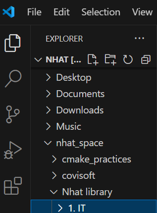
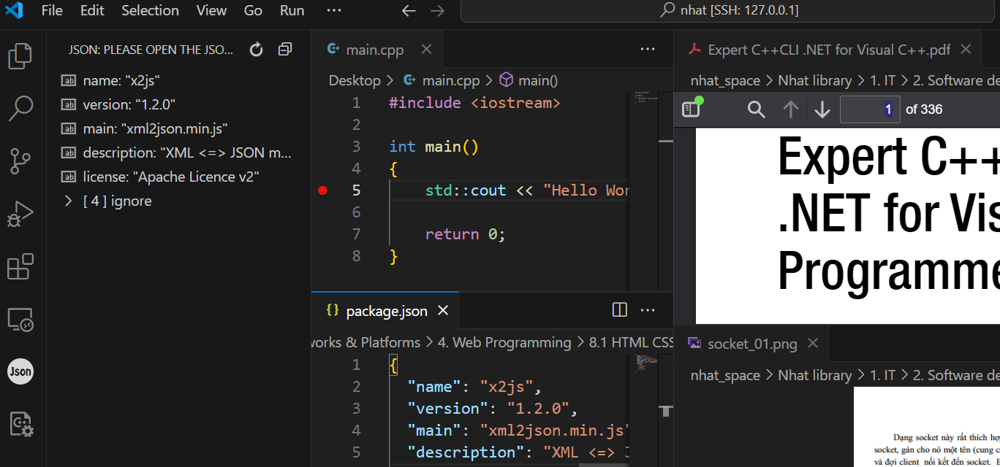
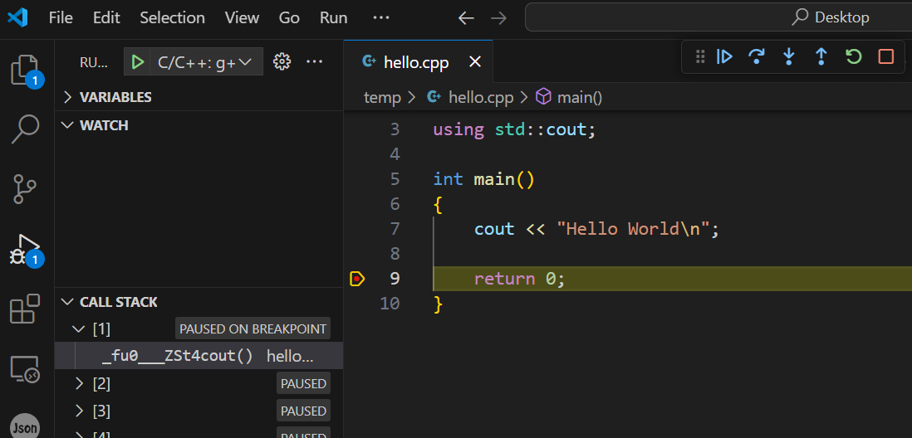
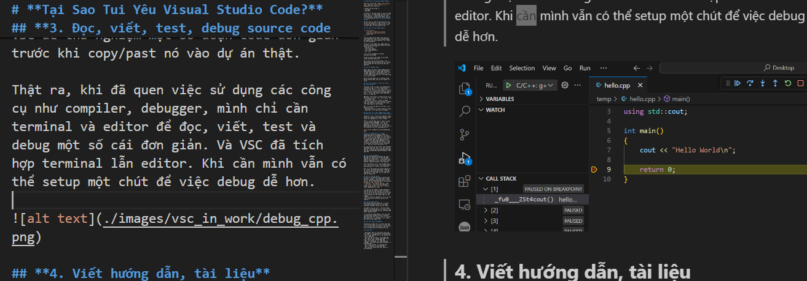
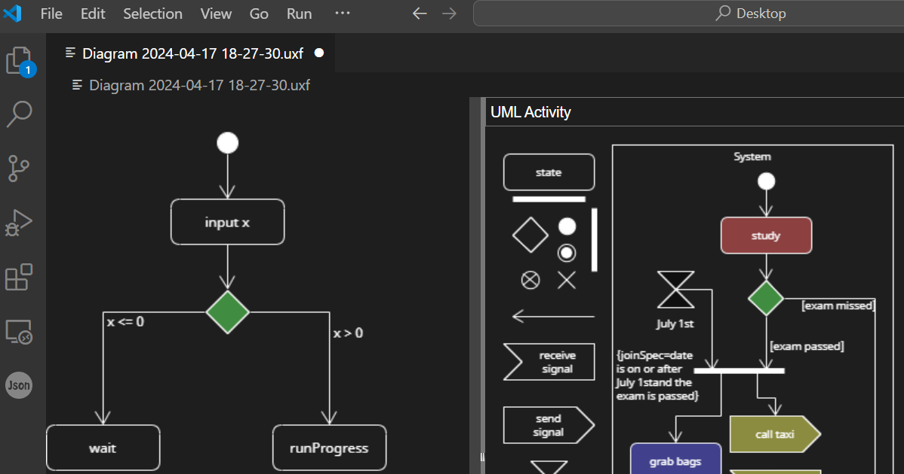

# **Tại Sao Tui Yêu Visual Studio Code?**

Đầu tiên, anh em lưu ý rằng `Visual Studio Code` (VSC) với `Visual Studio` (VS) là 2 application khác nhau nhé. Bài viết này nói về VSC.

Lúc đầu mình thích VSC vì: 
- Đẹp ngầu
- Miễn phí. 

Tuy nhiên lý do quan trọng níu chân mình gắn bó với VSC là sự tiện dụng, đa năng của nó.  Trong công ty và trong công việc cá nhân, mình đều đang sử dụng VSC để xử lý nhiều vấn đề **một cách dễ dàng nhanh chóng**. 

Sau đây mình sẽ liệt kê những việc đó. Nếu ai biết một công cụ nào khác có thể làm tất cả những việc tương tự (hoặc hầu hết) một cách dễ dàng, thì cho mình biết nhé.

## **1. Quản lý file, duyệt file**

    

Mình hay dùng VSC để Duyệt file thay cho “File Explorer” trên toàn hệ thống Windows lẫn Ubuntu (tất nhiên không hoàn toàn thay thế File Explorer).

Trong quá trình duyệt file, người dùng có thể xem nội dung nhiều định dạng file nhanh chóng, dễ nhìn. Ví dụ: 
- văn bản (txt), 
- hình (jpg, png,…), 
- file *.md (Markdown),  
- xml, json.

Chúng ta cũng có thể chỉnh sửa nội dung trong nhiều định dạng file.

VSC có khả năng nhớ những folder, file mà bạn đang mở. Lần sau bạn bạn có thể làm VSC trở về trạng thái lần cuối trước khi bạn đóng VSC.

## **2. Gõ command line**

Nhiều lập trình viên sẽ phải thường xuyên sử dụng command line trên giao diện terminal (Prompt, PowerShell, Linux Shell Bash). VSC tự động nhận ra các loại terminal mà máy tính của người dùng hỗ trợ và tích hợp trong cửa sổ con của VSC.

Bạn có thể mở nhiều cửa sổ terminal trong Visual Studio Code, sắp xếp lại layout của chúng.

## **3. Dễ dàng thao tác khi truy cập máy khác qua network**

Trong quá trình làm việc, mình thường xuyên truy cập máy khác (ví dụ từ Ubuntu hoặc Windows truy cập vào 1 máy Linux khác), rồi làm việc với các file, môi trường của máy từ xa ấy. Nếu máy remote ko hỗ trợ giao diện đồ họa, và chỉ hỗ trợ remote access bằng SSH, mình sẽ sử dụng VSC.

Bằng VSC, mình có thể làm việc với máy từ xa ấy như với máy local, với 2 tính năng cơ bản:
- Gõ command line.
- Duyệt file. (Lưu ý là trong lúc duyệt file, bạn cũng có thể xem nội dung của nhiều loại file như khi làm việc trên máy local. Tính năng tuyệt vời phải không).

Ngoài ra, khi truy cập máy tính khác từ xa, VSC còn hỗ trợ:
- Download file ở máy remote xuống máy local
- Copy file từ máy local lên máy remote

## **3. Đọc, viết, test, debug source code đơn giản (C/C++, Java, Python, Linux Shell)**

Trong quá trình làm việc mình thường sử dụng VSC để thử nghiệm một số đoạn code đơn giản trước khi copy/past nó vào dự án thật.

Thật ra, khi đã quen việc sử dụng các công cụ như compiler, debugger, mình chỉ cần terminal và editor để đọc, viết, test và debug một số cái đơn giản. Và VSC đã tích hợp terminal lẫn editor. Khi cần mình vẫn có thể setup một chút để việc debug dễ hơn.

## **4. Viết hướng dẫn, tài liệu**
Trong giới lập trình, người ta hay viết hướng dẫn dưới kiểu "Markdown". Với những kiểu này thì viết một đằng, còn hiển thị lại khác. Chúng cho phép hiển thị cả file ảnh và các đường dẫn. Bạn sẽ bắt gặp nhiều file `README` viết dưới dạng "markdown" nếu xem những dự án mã nguồn mở trên `github`. VSC có extension để preview văn bản "markdown", tức là xem nó sẽ hiển thị như thế nào. 

Bên cạnh đó còn có thể convert file Markdown sang HTML hoặc PDF. Vậy là với VSC, mình có thể tạo ra những văn bản hướng dẫn tương đối tươm tất, hấp dẫn dưới dạng "Markdown", HTML hoặc PDF.

## **5. Vẽ UML diagram**
UML (Unified Modeling Language) bản chất là tập hợp các loại biểu đồ và quy tắc được dùng để mô tả phần mềm và các hệ thống liên quan đến phần mềm. Ví dụ: flow chart, class diagram, sequence diagram, state diagram.

VSC có extension `Umlet` đáp ứng được việc vẽ cơ bản các biểu đồ ấy. Trên Linux cũng có phần mềm Umlet. Và nó hoàn toàn miễn phí.

Thực ra có những phần mềm chuyên nghiệp hơn để vẽ UML, tuy nhiên đều mất phí. Mình đã thử một số phần mềm free vẽ UML, cuối cùng thấy Umlet là tiện nhất. Cái này tùy cảm nhận mỗi người nhé.

## **6. Kết hợp với git**
Cơ bản thì git dùng để quản lý source code khi bạn làm việc. Ở mức thấp nhất nó cung cấp các command cho bạn điều khiển. Còn mức cao hơn thì có những phần mềm có dao diện để dễ thao tác như `"sourcetree"`, `"gitkraken"`. Tuy nhiên, bạn lưu ý rằng `"sourcetree"` chỉ hỗ trợ trên Windows và MacOS, trong khi đó `"gitkraken"` có trên Linux nhưng phải trả tiền.

Làm việc với git thuần túy bằng command thì cũng ổn thôi nếu chịu khó học. Tuy nhiên, mình thích set up để kết hợp git với VSC sao cho một số tác vụ trở nên dễ dàng hơn, như:
- Viết message cho mỗi Commit (ghi chú khi commit)
- Resolve conflict (display 2 cửa sổ so sánh code 2 version bị conflict nhau để mình resolve.)

## **7. Test REST API**
Mình không code web, nhưng khi làm những tính năng cần Rest API thì sẽ thử dùng extension "Thunder Client" để test trước.

Cảm nhận riêng của mình là vẫn thích dùng Postman hơn, nhưng dạo sau này công ty mình không cho dùng Postman nữa nên mình đổi sang dùng "Thunder Client".

Và sau một thời gian dùng dài thì mình lại cảm thấy dùng "Thunder Client" trong VSC luôn cho tiện. Máy tính cá nhân của mình bây giờ cũng ko còn cài Postman. Cái này cũng tùy sở thích mỗi người thôi.

## **8. Test SQLite database**

Cũng tương tự phần trên, mình hay test mấy câu truy vấn trước khi nhúng vào trong code của mình (tất nhiên có test lại lần nữa). Và VSC có extension để test SQLite dễ dàng.

## **Tóm Lại**

- Khi duyệt, quản lý file ở máy local lẫn máy remote -> Nếu đang ở VSC, mÌnh dùng VSC.
- Khi cần gõ command line -> Nếu đang ở VSC, mình sẽ dùng VSC.
- Khi truy cập máy khác -> Mình dùng VSC.
- Khi cần học, thử nghiệm code ngắn C/C++, Java, Shell, HTML -> Mình dùng VSC.
- Khi viết hướng dẫn, tài liệu hoặc đọc "README" của project dưới dạng "markdown" -> Mình dùng VSC.
- Khi vẽ UML diagram -> Mình dùng VSC.
- Khi sử dụng git -> Mình dùng VSC.
- Khi cần test nhanh REST API, SQLite -> Mình dùng VSC.

Microsoft đã tặng anh em dev một phần mềm miễn phí cực kỳ nhẹ và cực kỳ đa năng. Thế nên anh em nào thích sử dụng VSC, cứ thoải mái đi, đừng ngại khó ngại mất thời gian. Bởi vì nó rất đáng đồng tiền bát gạo.

