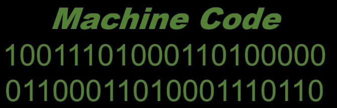
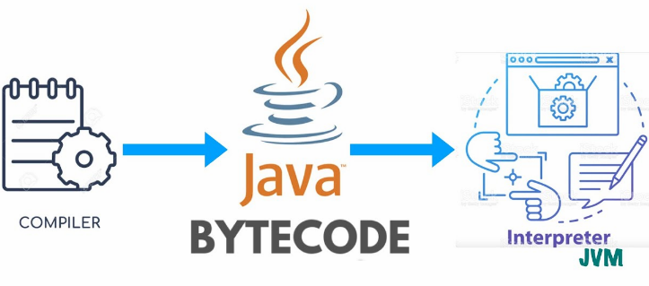
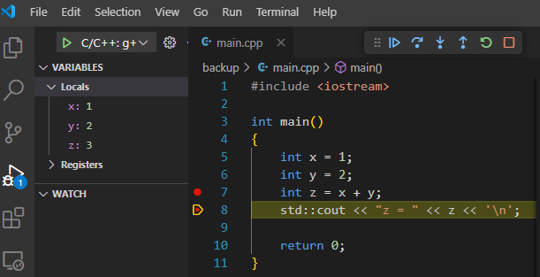

# <p align="center">**Các Khái Niệm Cơ Bản Liên Quan Đến Viết Code và Build phần mềm**</p>

Trong quá trình học lập trình ở trường lớp và quá trình tự đọc tài liệu, chắc hẳn các bạn không ít lần bối rối vì không hiểu nhiều thuật ngữ. Ví dụ bạn không hiểu "code" với "source code" khác nhau chỗ nào, hoặc cảm thấy "toolchain" sao nó có vai trò giống "compiler", rồi đã có toolchain lại còn có SDK là gì nữa?

Bài viết này sẽ giải thích cho các bạn biết một vài khái niệm cơ bản liên quan đến việc viết code và build phần mềm. Việc nắm vững hơn các khái niệm này tin chắc sẽ giúp bạn dễ dàng tiếp thu lời giảng hoặc đọc tài liệu nhanh hiểu hơn.


## **Code (mã)**

Code là một tập hợp các chỉ thị được viết bằng ngôn ngữ nào đó, hướng dẫn máy tính thực hiện các nhiệm vụ cụ thể.

Code có thể là machine code (mã máy) hoặc source code (mã nguồn). Để hiểu chi tiết hơn, hãy đọc tiếp các phần sau.

## **Machine code (mã máy)**

Machine code (Mã máy) trước hết là code giống khái niệm đã nói ở trên, nhưng bản chất là dãy bit hoặc byte được viết dựa trên ngôn ngữ máy có ý nghĩa đối với máy, được biểu diễn dưới dạng nhị phân hoặc thập lục phân.

Vì mã máy rất khó hiểu đối với con người, thông thường lập trình viên sẽ không viết mã máy. Thay vào đó, họ viết code bằng một ngôn ngữ lập trình nào đó (như C, C++, Java, Kotlin, Python), rồi mới được chuyển thành mã máy để chạy.



## **Source code (mã nguồn)**

Source code là code được viết bằng một ngôn ngữ lập trình nào đấy.

Ví dụ sau đây là mã Python (Python code):
```python
print("Hello, World!")  # This is a code line
x = 10  # Another code line
```

## **Bytecode**
Trước hết, bytecode là một dạng code không phải machine code cũng không phải source code. Thế cụ thể nó là gì? Thay vì định nghĩa nó, mình sẽ làm 1 ví dụ như sau cho dễ hiểu.

Có nhiều file thực thi dành cho Windows không thể chạy trên Linux, bởi vì Windows và Linux là hai hệ điều hành khác nhau với kiến trúc và cách thức hoạt động khác nhau. Thế nhưng bằng cách cài máy ảo Java trên cả 2 máy (JVM), và compile code Java của bạn ra bytecode, thành file thực thi thì nó có thể chạy trên cả Windows và Linux. Bạn có thể xem "bytecode" là ngôn ngữ máy của một loại máy ảo. 

(Còn cấu trúc bytecode thế nào, làm sao người ta tạo được máy ảo đọc được bytecode thì mình không bàn, vì chúng ta không cần biết, trừ phi bạn muốn tạo ra hay tùy chỉnh một máy ảo cho riêng bạn).



## **Compile and Compiler (biên dịch và trình biên dịch)**
Biên dịch là quá trình chuyển đổi mã nguồn thành mã máy (machine code), hoặc thành bytecode, hoặc thành mã của một ngôn ngữ khác. Và, trình biên dịch (compiler) đảm nhận nhiệm vụ ấy. Ví dụ: các file code C/C++ có thể được compile thành file code Assembly hoặc file object (cái này do người sử dụng compiler quyết định), hay Java có thể được compile thành bytecode.

Các mã này thường được lưu trong các file trung gian, để chờ biên dịch tiếp hoặc chờ linker liên kết lại với nhau tạo thành file thực thi.


## **Interprete and Interpreter (thông dịch và trình thông dịch)**

Thông dịch là quá trình thực thi mã nguồn trực tiếp bằng một chương trình gọi là trình thông dịch (interpreter). Không có bước biên dịch thành mã máy trước khi chạy.

Ví dụ: Code Python thường được chạy trực tiếp không cần biên dịch.

## **Linker (trình liên kết)**
Linker sẽ liên kết các file chứa mã máy lại với nhau thành file thực thi.

## **Build**
Build project, application, software là quá trình tạo ra sản phẩm từ mã nguồn. Sản phẩm đó có thể là file thực thi, file thư viện hoặc các file trung gian.

## **Host device and Target device (Thiết bị chủ và thiết bị mục tiêu)**
Host device hoặc host machine là thiết bị bạn sử dụng để build ra phần mềm chạy trên target device (target machine).

Target machine là thiết bị mà phần mềm bạn build ra có thể chạy trên đấy.

**Ví dụ**: Bạn có một máy Windows, bạn để source code trên Windows, và build ra phần mềm chạy trên điện thoại Android. Thế thì máy Windows ở đây là host device và điện thoại Android là target device.

## **Debug and debugger**
Debug Là quá trình tìm và sửa các lỗi trong source code (mã nguồn).

Debugger là application hỗ trợ cho việc debug. Thông thường một debugger có các tính năng sau:
- Run một application khác (app mà bạn tạo ra đó).
- Tạm dừng application ở một dòng code nào đấy.
- Tiếp tục chạy.
- Đọc và sửa giá trị của các biến tại thời điểm tạm dừng application.
- Thoát chương trình.

Khi bạn thấy Visual Studio, Eclipse, Codeblocks có các tính năng như trên là do đã có tích hợp debugger rồi đấy.



## **Editor (trình soạn thảo)**

Là phần mềm cho phép nhập văn bản rồi lưu lại thành file.

Ví dụ:
- Nodepad trên Windows hay Gedit trên Linux là editor.
- Word cũng là editor (nhưng người ta thường không sử dụng Word để viết code).

## **Toolchain**
Toolchain là tập hợp của các công cụ dùng để biên dịch mã nguồn thành các file thực thi có thể chạy trên thiết bị mục tiêu. Toolchain bao gồm:
- compiler (trình biên dịch)
- linker (trình liên kết)
- debugger (trình sửa lỗi)
- Các tool khác
- Thư viện
- Một số tool (application).

Có thể chia toolchain là hai nhóm:
- Native toolchain: Chạy trên hệ thống giống với thiết bị mục tiêu. 
- Cross toolchain: Chạy trên hệ thống này nhưng tạo ra file thực thi chạy trên hệ thống khác. (Ví dụ khi bạn ở trên máy Linux mà build application cho Windows)

## **SDK (Software development kit - bộ phát triển phần mềm)**

SDK là một bộ gồm nhiều thứ "gì đấy" để hỗ trợ lập trình viên xây dựng một số tính năng của phần mềm. Ví dụ "Google Maps SDK"

SDK bao gồm:
- Thư viện để sử dụng trong source code.
- Sample code (code viết sẵn để copy vào code của dự án).
- Toolchain (có thể có hoặc không)
- Hướng dẫn sử dụng (có thể có hoặc không).

Nhớ lưu ý là SDK có thể có toolchain hoặc không. Vì trong nhiều trường hợp, không cần thiết phải sử dụng toolchain riêng để biên dịch mã nguồn trong SDK. Ví dụ:
- Android SDK có bao gồm toolchain.
- Windows SDK, Google Maps SDK, Facebook Login SDK đều không có toolchain mà chỉ cung cấp thư viện.

## **IDE (Intergrated Development Environment - môi trường phát triển tích hợp)**
IDE là phần mềm để các lập trình viên tạo ra sản phẩm dễ dàng hơn bằng cách hỗ trợ nhiều tính năng. Một số tính năng quan trọng phải có trong IDE như: 
- Viết code
- Compile
- Build
- Run ứng dụng
- Debug
- Chỉnh sửa config cho các quá trình compile, build, run, debug.

Để hỗ trợ nhiều tính năng, một IDE thường tích hợp nhiều thứ khác kèm với nó, ví dụ:
- Editor (trình soạn thảo)
- Một hoặc nhiều bộ SDK
- Một hoặc nhiều toolchain
- Một số application đi kèm.
- Có thể add thêm pluggin/extension.