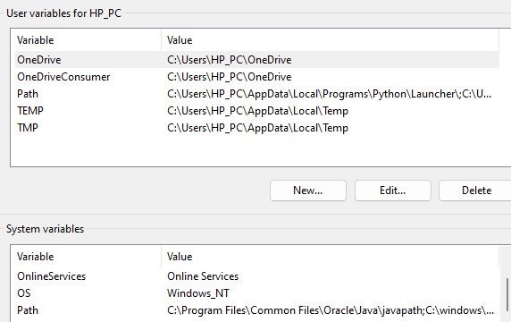
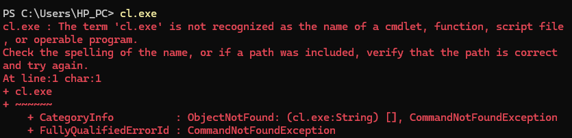
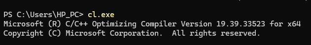

# **Understanding About Environment Variable `"PATH"`**

# **Introduction**

Every computer user, especially software developer should understand about the environment variable `"PATH"`. The reason is: sometimes, when installing software, users need to edit the environment variable ‘PATH’ according to instructions. 

This article will briefly explain it to help you easily manage the "PATH" environment variable in the future, reducing reliance on specific instructions.

## **1. Environments variables**

Environment variables are dynamic named values stored within an operating system that applications and services use to customize their behavior. These variables allow you to set specific configuration options for various aspects of the system.

### **Notes:**
- On Linux, environment variables are capitalized (written in uppercase).
- On Windows, environment variable names are not case-sensitive. This means that whether you use uppercase or lowercase letters, the system treats them as the same variable.
- For example: `"PATH"` and `"Path"` refer to the same environment variable.

### **Some environment variables on Windows**

| Variable  | Description                           |
|-----------|---------------------------------------|
|PATH	    | List of directories where the system looks for executable    files and `dynamic linked libs`. 
|HOMEPATH	| Path to the user’s profile folder (e.g., `C:\Users\username`).
|APPDATA    | Path to the user-specific roaming application data folder.

### **Some environment variables on Linux**

| Variable          | Description
|-------------------|-------------|
|PATH               | List of directories where the system looks for executable    files (`Not for dynamic linked libs`)
|HOME	            | User’s home directory.
|PWD	            | Current working directory. (no Windows env var is equivalent to PWD)
|LD_LIBRARY_PATH    | List of directories where the system looks for `dynamic linked libs`

### Remarks:
- `"PATH"` is list of directories where dynamic linked libs are located on Windows but `not` on Linux.
- `LD_LIBRARY_PATH` is empty by default on most of Linux systems. However we can set it temporarily or permanently.

## **2. "User environment variables" and "system environment variables"**

If you are using Windows, you may wonder why a `"Path"` is in `"User variables"` and another `"Path"` in `"System variables"`. One is for specific user profile and one is for all users.

## **3. `"PATH"`**

### **3.1. Concept**
The environment variable `"PATH"` the list of directories where the system looks for executable files (and dynamic linked libs if your OS is Windows).

### **3.2. Why do we have to edit `"PATH"` ourselves?**

Sometimes, when we install software, Windows may automatically add new directories containing executable files to `"PATH"` . However, there are other instances Windows doesn't do this - it depends on the specific software package you install. That's why sometimes we have to modify `"PATH"` ourselves.

You might wonder why Windows don't do it automatically all the time. It depends on the developers who created the installed software. As for why they make that choice, I won’t delve into it right now.

Let's move on to the following example for more understanding.

### **3.3. An examples of `"PATH"` on Windows**

After installing Visual Studio with packages of C/C++, you can compile your C/C++ file using Visual Studio. Indeed, Visual Studio uses a compiler which is a file named `"cl.exe"`. However, if you call `"cl"` command in terminal, it cannot be found. That's because the directory which contains `"cl.exe"` hasn't been added to `"PATH"`.

It means that when any application use `"cl.exe"` command, it won't work. To make it avaiable, look for the directory of `"cl.exe"` and add the directory to `"PATH"`. Then, `"cl.exe"` command will work.

You might wonder why Visual Studio can copmile your source code. The reason is Visual Studio knows the path of `"cl.exe"` itself. 

## **Conclusion**

So the article has explained the concept of the environment variable ‘PATH’, and why sometimes you have to edit it. From now on, you can use your knowledge of it to apply when installing software. Enjoy your code 😊”